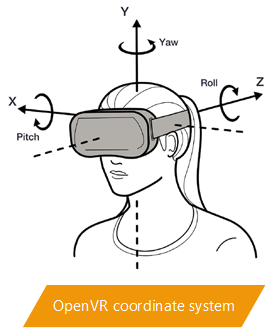
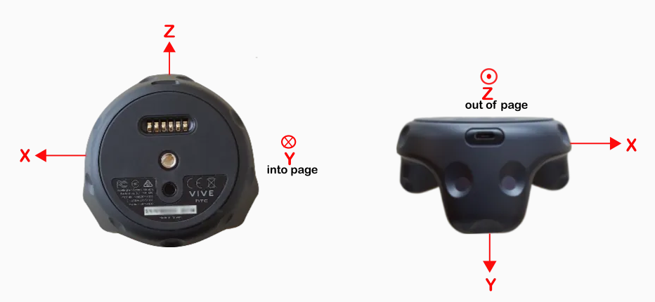

Copied code from [
OpenVR-Tracking-Example](https://github.com/osudrl/OpenVR-Tracking-Example) but tweaked to build with Visual Studio. 

## OpenVR Coordinate System

* +y is up
* +x is to the right
* -z is forward, -z is in front of you and +z is behind you
* distance unit is meter




## Vive Tracker Axis Direction



## Action Binding

 * [Getting started on the new steamvr input system with Unreal Engine 4.21](https://medium.com/@runeberg/getting-started-on-the-new-steamvr-input-system-with-unreal-engine-4-21-7856a02f4b38)
 * [Steamvr Input Profiles](https://github.com/ValveSoftware/openvr/wiki/Input-Profiles)


## Identify Vive Tracker with the Serial number

How to get the serial number to identify all the given vive trackers:
```cpp
char serialNumber[1024];
vr::VRSystem()->GetStringTrackedDeviceProperty(deviceID, vr::Prop_SerialNumber_String, serialNumber, sizeof(serialNumber));

printf("Serial Number = %s \n", serialNumber);
```
would output like this:
```
Serial Number = LHR-0DC0F431
```

## SteamVR Announcement: [Recent Vive Tracker Changes](https://steamcommunity.com/games/250820/announcements/detail/1697186829260359619)
Date: 2018.10.11.

>*SteamVR Input added the ability to configure a tracker as "held in hand", which makes the tracker act as a controller. It also added default bindings for those controllers that work in many games in category 3 (and the ability to rebind inputs for many more games.)*

See the entire announcement on [here](https://steamcommunity.com/games/250820/announcements/detail/1697186829260359619).


## Device Connect Event

Whenver a device is connected (aka. turnning on its power), `VREvent_TrackedDeviceActivated` event is set. You can retrieve device ID with `VREvent_t::TrackedDeviceIndex_t`.


## Standing vs Seated

>*TrackingUniverseStanding* assumes 0,0,0 to be on the floor in the center of the Play Area set during Room Setup.
>
>*TrackingUniverseSeated* assumes 0,0,0 to be the player's head. The seated universe center is set and saved by calling ResetSeatedZeroPose through the OpenVR API (many older seated games already do this on start or on key press) or within the Dashboard options menu (press the system button and click on the gear icon). The Dashboard options means that devs no longer need to implement a calibration screen in each game and because the seated center is saved across session it isn't necessary to set at the start.
>
>I'd strongly encourage seated games to use the seated universe rather than standing universe.

The original post can be found on [here](https://steamcommunity.com/app/358720/discussions/0/487877107142761642/)